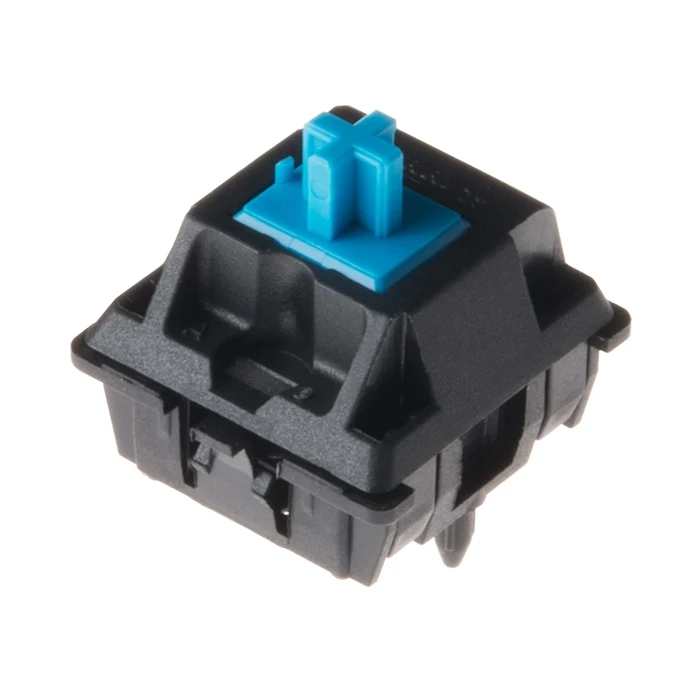
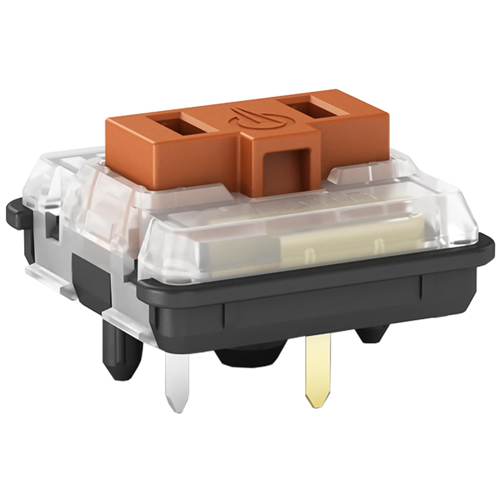
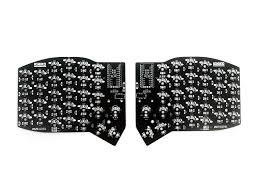

% DIY Keyboards
% Robert Ward <robert@rtward.com>
% Talk: [${TALK_URL}](${TALK_URL}) Repo: [${REPO_URL}](${REPO_URL})

# DIY Keyboards

## Or

## How I learned to stop worrying and love the blinky lights

# Why?

## Cheaper?

. . .

no

## More Reliable?

. . .

no

## Better?

. . .

maybe?

## More Fun?

. . .

definitely

## Because

## RSI

::: notes

More an argument for ergo

:::

## Custom Layouts

::: notes

Want to try out DVORAK or Colemak or Workman?

:::

## Macros

::: notes

Your keybaord can do more than 1 press = 1 letter

:::

## Layers

::: notes

Change your whole layout with one key

:::

## It's Cool

::: notes

Lets be honest

:::

# Okay I'm Convinced

# Parts of a Keyboard

## Keycaps

::: notes

Starting with the most important part, obviously.

So many options

:::

## Switches

::: notes

Two basic options, MX or Choc

Lots of other options though.

:::

## Key Matrix

::: notes

Columns are powered one at a time and the rows are all read at once

Done hundreds of times per second

:::

## Shield

::: notes

If you're hand wiring, then this may not apply, but for premade PCBs you can select an existing wiring diagram.

:::

## Accessories

- Encoders
- Trackballs / Trackpads / Pointers
- Screens
- RGB
- ???

## Microcontroller

- Wired or Wireless
- How many inputs?

- Pro Micro is the most common format
- Nice!Nano for Wireless

## Firmware

- Wired or Wireless
- ZMK for Wireless
- QMK for Wired
- Lots of offshoots of QMK

# Building a Keyboard

## Design your Keyboard

Cosmos

https://ryanis.cool/cosmos/

## Design your Keyboard

## Pick you switches

::: notes

might not be important if you're doing hot swaps

:::

## Plan your wiring

::: notes

you'll need num rows + num cols inputs on your board, so minimizing is good

also consider difficulty of wiring

also consider thumb keys if doing an ergo

hot swap vs soldered in

:::

## Plan your accessories

::: notes

make sure you know how many inputs you need

check out com protocols like i2c or spi, which can be shared in some cases

:::

## Plan your controller

::: notes

wired or wireless is the big question

also look at firmware compatibility

also look at number and types of IO ports

:::

## PCB / Shield vs Hand Wiring

::: notes

shield = easier

hand wiring = more customization

:::

## Setup your Firmware

## QMK

::: notes

most popular

mostly used for wired builds

lots of spinoffs

vial etc.

:::

## ZMK

::: notes

mostly used for wireless builds

less accessory support

community not quite as big

making rapid progress

:::

## Cosmetics

::: notes

case, tenting, etc.

:::

## Proft!

::: notes

You've got a cool ass keyboard now

You can spend the next few months tweaking the keymap to be just what you want

:::

# Questions?

---

Robert Ward <robert@rtward.com>

Talk: [${TALK_URL}](${TALK_URL})

Repo: [${REPO_URL}](${REPO_URL})
