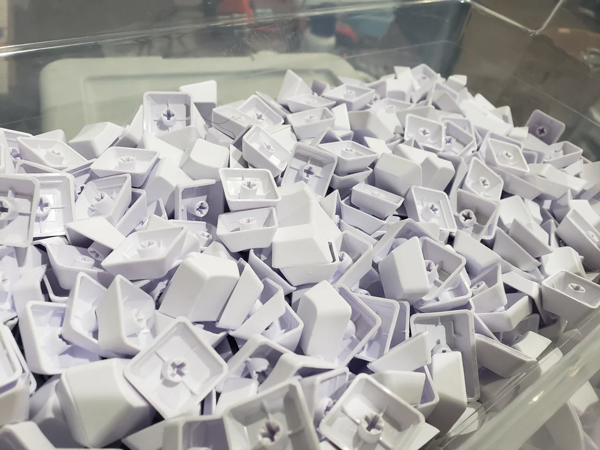
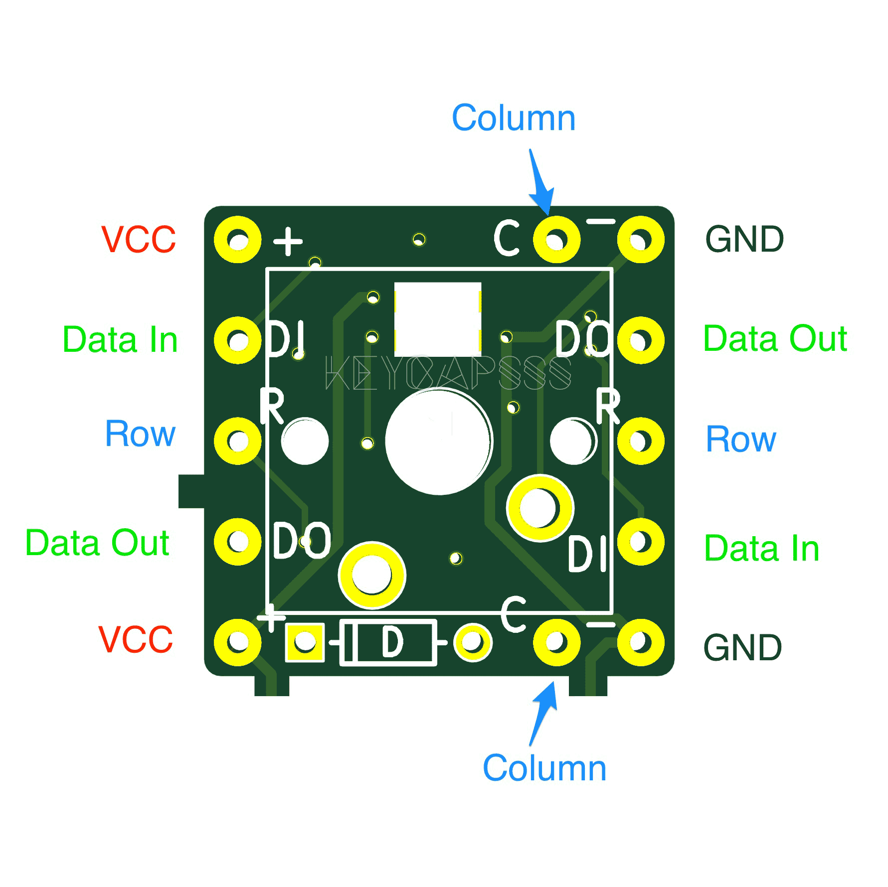

% DIY Keyboards
% Robert Ward <robert@rtward.com>
%<br/>Talk: [${TALK_URL}](${TALK_URL})<br/>Repo: [${REPO_URL}](${REPO_URL})

# DIY Keyboards

## Or

## How I learned to stop worrying and love the blinky lights


# Why?


## Cheaper?

. . .

no

## More Reliable?

. . .

no

## Better?

. . .

maybe?

## Because

## RSI

{ width=100% }

::: notes

More an argument for ergo

My story

:::

## Custom Layouts

::: notes

Want to try out DVORAK or Colemak or Workman?

:::

## Macros

<div align="center">
```
(•_•) ( •_•)>⌐■-■ (⌐■_■)
```
</div>

::: notes

Your keybaord can do more than 1 press = 1 letter

:::

## Layers


::: notes

Change your whole layout with one key

:::

## It's Cool


::: notes

Lets be honest

:::

# Okay I'm Convinced

# How do I do it?

## Design your Keyboard


## Design your Keyboard


# Collect your parts

## Keycaps



::: notes

Starting with the most important part, obviously.

So many options

:::

## Keycaps


## Keycaps


## Keycaps


## Switches


::: notes

Two basic options, MX or Choc

:::

## Switches


::: notes

Choc are low-profile if you're trying to build a smaller board

:::

## Switches


## Switches


## Switches


## Shield / PCB / Sockets / Hand Wired


## Shield / PCB / Sockets / Hand Wired


## Shield / PCB / Sockets / Hand Wired



## Shield / PCB / Sockets / Hand Wired


## Accessories


## Accessories


## Accessories


## Accessories


## Accessories


## Microcontroller / Firmware

::: incremental

- Wired or Wireless
- How many inputs?

:::

## Microcontroller / Firmware

::: incremental

- QMK
  - The default
  - Wide support
  - Lots of offshoot projects (via, vial, etc.)
  - Mostly for wired boards

:::

## Microcontroller / Firmware

::: incremental

- ZMK 
  - The upstart
  - Less board support
  - More difficult to get started
  - Mostly for wireless boards

:::

## Microcontroller / Firmware


::: notes

This is the most common format for controllers

There are lots of controllers that share the same pinout, not just clones

:::

## Microcontroller / Firmware


::: notes

This is a copy of the pro-micro format for wireless builds

:::

## Microcontroller / Firmware


::: notes

This is a chonky boy if you want lots of inputs

:::

## Case


# Building a Keyboard

## Shopping List

::: incremental

 - [x] Keycaps
 - [x] Switches
 - [x] PCB
 - [x] Accessories
 - [x] Microcontroller
 - [x] Case
 
:::

## Assemble your board


::: notes

Depends on how you're putting it together

Might put switches in first, might do sockets first

:::

## Wire your board


::: notes

you'll need num rows + num cols inputs on your board, so minimizing is good

also consider difficulty of wiring

also consider thumb keys if doing an ergo

hot swap vs soldered in

:::

## Wire your board


## Setup your Firmware

## QMK


::: notes

most popular

mostly used for wired builds

lots of spinoffs

vial etc.

:::

## QMK


## QMK


## QMK

```
sudo pacman -S qmk
qmk setup
qmk flash -kb sofle -km default
```

## ZMK


::: notes

mostly used for wireless builds

less accessory support

community not quite as big

making rapid progress

:::

## ZMK

 1. Create a new Github Repo called `zmk-config`
 2. `bash -c "$(curl -fsSL https://zmk.dev/setup.sh)"`

## ZMK


## ZMK


## ZMK


## ZMK

```
unzip firmware.zip
cp my-keyboard.u2f /var/run/media/rtward/NICENANO
```

## ZMK


## ZMK

Demo Time

## ZMK

::: incremental 

 1. Find a keyboard that's close
 2. Copy the board over
 3. Edit the physical layout (.dtsi)
 3. Edit the sides if split
 3. Edit the board for accessories
 3. Update your build.yaml
 3. Push to GitHub

:::

# Congrats!

## Congrats!


::: notes

You've got a cool ass keyboard now

You can spend the next few months tweaking the keymap to be just what you want

:::

# Advice

## Macro Pad


::: notes

Build a macro pad first.

It's basically all the same work, but much easier.

:::

## Experiment


::: notes

Play around with designs and keymaps, find what works for you.

:::

## Commit


::: notes

Stay committed to using your new board and trying new layouts.

You'll be surprised how quickly you can adapt.

:::

# Questions?


---

Robert Ward <robert@rtward.com>


Talk: [${TALK_URL}](${TALK_URL})

Repo: [${REPO_URL}](${REPO_URL})
